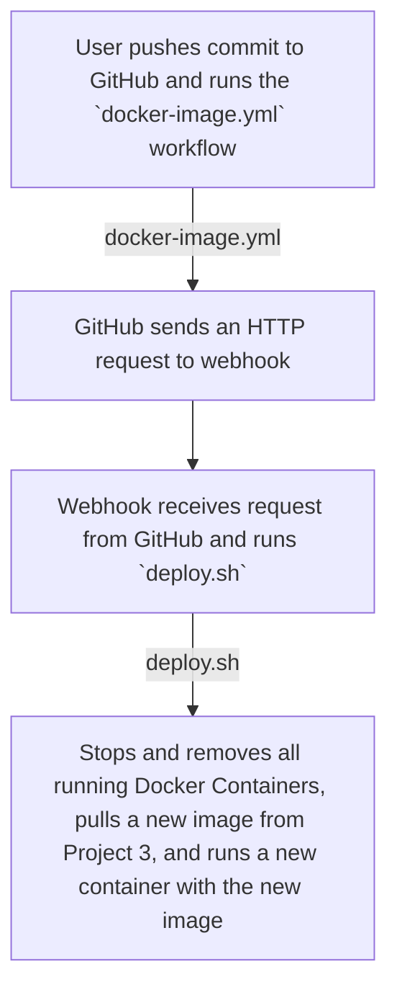

# CD Project Overview

The goal of this project is to continuously deploy a new Docker image containing updated web content into a website running off of the Docker image.

Tools used in this project:
* Webhook - Used to run the deploy script whenever it receives an HTTP request with a secret.
   * Go - language used to run Webhook
* GitHub - Used to send a webhook to the server to deploy a new Docker image.

## Diagram




## What's not working
The webhook definition file does not have a blacklist when receiving a request. I've tried looking into whitelisting or using regex for GitHub requests to no avail. 

# Script a Refresh

## EC2 Instance Specifications

* AMI: Amazon Linux Server
* Size: 30 GB
* SG Configuration:
    * Allows SSH Inbound from Wright State campus and Aidan's house in Dayton, OH.
    * Allows ports 80 and 8080 inbound from anywhere.
    * Allows SSH from within the VPC

## Docker Setup
To setup Docker, follow these instructions:
1. Install docker by executing the following command:
```bash
sudo yum update
sudo yum upgrade
sudo yum install docker
```
2. Enable the Docker service by executing this command:
`sudo systemctl enable --now docker`
3. To test if Docker is initialized, run the following command:
`docker run hello-world`

## Testing on Instance
To pull a Docker container image, run the following command:

`docker pull <repository>/<image_name:version>`

Example for the project 3 website:

`docker pull amcgohan/project3-website:version`

To run the container, use this command:

`docker run -d --restart always -p 8080:80 <repository>/<image_name:version>`

`-d` runs the container in a detached instance, so you are able to use your OS freely.
`-p` binds the container to port `8080` that can be accessed outside of the host system.

To test the container after running/starting it, use this command:

`docker exec -it <container_name> bash`

`-i` allows standard input to the container that can be used for testing
`-t` allows the use of a TTY, or `teletypewriter` that acts as a virtual terminal instance.

## Scripting Container Application Refresh

The bash script executes the following actions in order:

1. Stops all running containers
2. Removes/deletes all stopped containers
3. Pulls latest image from `amcgohan/project3-website`
4. Runs the newly installed image binded to port `8080`

To test if the script works, input the public IP address of the host machine with port `8080` to your web browser. For example, `http://18.204.74.101:8080/` is a valid address to access the website.

[Link to Script](/deploy.sh)

# Listen

## Configuring a `webhook` Listener

To install adnanh's webhook, follow these steps:
1. Install `go` by running `sudo yum install go`
2. Fix the path environment of `go` by running `go env -w GO111MODULE=auto`
3. Install adnanh's webhook by running `go install github.com/adnanh/webhook@latest`
4. After installing, `webhook` should be in the `go` directory in the user's home folder. To verify installation, run `./go/bin/webhook`.

The `webhook` definition file consists of an id with a command to execute (ex. `./deploy.sh`). The command is triggered by a HTTPS request but it has to be checked against some rules, one being a secret rule with `secret_tunnel` as the password, and the other rule is to check if it came from either GitHub or DockerHub. 

To verify if the definition file was loaded by `webhook`, run the definition file with the following command:
`sudo path/to/webhook_exec -hooks /path/to/hooks.yaml -verbose`
Connect to the `webhook` listener by using this URL:
`http://184.73.154.239:9000/hooks/ID_FROM_DEF_HERE?token=SECRET`

To view `docker` processes and when they were created/started, run `docker ps -a`

[Link to Definition File](/deployment/hooks.yaml)

## Configuring a `webhook` Service

The webhook service file contains instructions on how `webhook` should be used when the instance starts. It uses `systemctl` to run in the background of the server.
   * [Unit]
      * `Description` is a "one-line" summary of the service.
      * `After` is for the order that services start.
   * [Service]
      * `User` is the user that the daemon runs as
      * `Group` is the group that the daemon runs as
      * `ExecStart` is the command that the daemon executes
      * `Restart` is the condition on when the service should restart
   * [Install]
      *  `WantedBy` lists the units that depend on this unit
    
After adding the service file to `/etc/systemd/system/`, the service needs to be enabled. To enable and start the webhook service, run the following commands:

`sudo systemctl start webhook.service`
`sudo systemctl enable webhook.service`

[Link to Service File](/deployment/webhook.service)

# Configuring a Payload Sender

I chose GitHub as the payload sender so when developing/adding web-content to the repository, I can use `git push` and the content is visible on the Docker Container efficiently.

Whenever there is a `push` on GitHub, it will immediately trigger the webhook found in the `docker-image.yml` workflow job.

To verify a successful payload delivery, I connected to the instance via `ssh` and used `journalctl -f` to view ongoing logs from Systemd. When a webhook is triggered, the logs are immediately displayed on the terminal.

I could not figure out how to validate GitHub as the only payload sender. I've tried looking into whitelisting IPs for GitHub but there wasn't clear documentation on how to execute it.

# Resources

* https://www.datacamp.com/tutorial/docker-stop-all-containers
  * Used for `deploy.sh` to kill and remove all containers

* https://docs.docker.com/reference/cli/docker/container/exec/
   * Used to run commands without going into the docker container

* https://docs.redhat.com/en/documentation/red_hat_enterprise_linux/9/html/using_systemd_unit_files_to_customize_and_optimize_your_system/assembly_working-with-systemd-unit-files_working-with-systemd
   * Used to create the webhook service file
 
* https://github.com/adnanh/webhook/blob/master/docs/Hook-Rules.md
   * Used to create rules for webhook definition file
