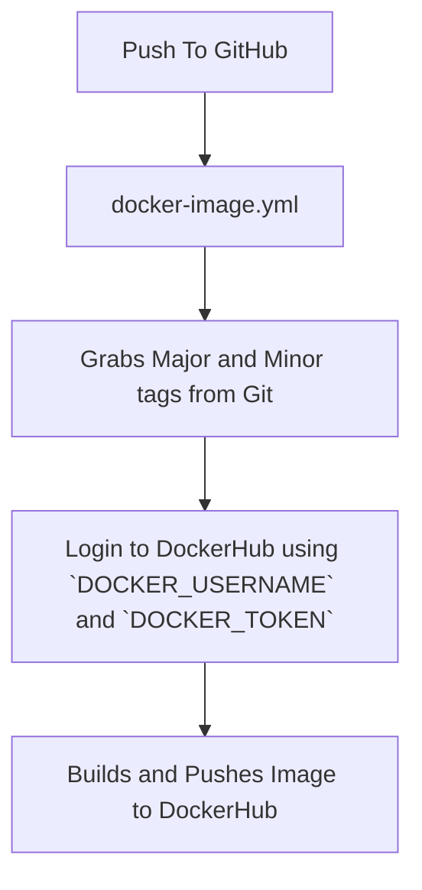

# Dockerfile & Building Images

## Whats Contained In This Repository?
The web content in this repository is stylized after "old-internet" and "vaporwave". Website was made using Google AI Studio using the following prompt:

**Create an index and about html page with a css theme that has "old-internet" "vaporwave" style.**

[Link to Web Content](Project4/web-content/)

The Dockerfile contained in this repo builds an Ubuntu image built on httpd that deploys a vaporwave-themed web server to the httpd web content directory.

[Link to Dockerfile](Project4/web-content/Dockerfile)

## How To Build an Image

To build an image from the repository, in the `web-content` directory run the following command:

`docker build -t IMAGE_NAME .`

This will create an image with a specified name using all contents within the current directory.

To build a tagged image for DockerHub, run the following command:

`docker build -t DOCKERHUB_USERNAME/REPONAME:IMAGE_TAG .`

where `DOCKERHUB_USERNAME` is the username of the users DockerHub account, `REPONAME` is the repository that belongs to the username, and `IMAGE_TAG` contains the version of the image (ex. "v1.1.0" or "latest").

## How To Run a Container

To run a container after building an image, run the following command:

`docker run -d -p 8080:80 --name CONTAINER_NAME IMAGE_NAME:IMAGE_TAG`

where `-d` runs the container detached, `-p` opens port `8080` and `80` to connect to the web server, and `CONTAINER_NAME` is the user-defined container name. 

# Setting Up GitHub Actions with DockerHub

## Configuring GitHub Repository Secrets

For GitHub to access DockerHub to push new images to a repostiory, a Personal Access Token is needed from DockerHub. To create one and link it to GitHub, follow these steps:

1. After signing into DockerHub, click your profile in the top right corner and click `Account Settings`, then `Personal access tokens` on the left.

2. Click `Generate new token` and give it a descriptor, such as "GitHub Actions for Web Content repo". Give the token an expiration date and Read & Write permissions for GitHub to push new images and delete old ones.

3. Once the token has been made, copy the token and go to your GitHub repository and click `Settings`, `Secrets and Variables`, then `Actions`, and click `New repository secret`.

4. In your new repository secret, name the secret `DOCKER_USERNAME` and input your DockerHub username in the "Secret" field. After adding the secret create a new one called `DOCKER_TOKEN` and paste the Docker token into the "Secret field".

After following these steps, you can go on to create a new workflow for GitHub Actions.

## CI with GitHub Actions

Whenever a certain event happens when pushing a commit to GitHub, GitHub Actions has a trigger effect depending on the event. For instance, whenever a commit is pushed in this repository, a new image is pushed immediately to DockerHub. This is created by workflow steps, and for this repository it can be seen [here](.github/workflows/docker-image.yml).

When a trigger happens, the workflow steps are activated. Each `job` in the workflow file are the steps that are taken. For instance, `Login to DockerHub` uses the `DOCKER_USERNAME` and `DOCKER_TOKEN` variables to intialize building and pushing to the Docker repository. 

To use the YAML file in a different repository, the values that need to be changed will be the repository in the `images` field under the `Docker meta` job and the path to the Dockerfile under `Build and Push Docker Image`.

To test if the workflow works, simply use `git add`, `git commit`, and `git push` to trigger the workflow. If the YAML file fails, GitHub will make the error visible with a red cross in the Actions page. 

You can verify that the image in DockerHub works simply by pulling the image off Docker using `docker pull DOCKER_USERNAME/REPONAME` and testing the image.

Link to my DockerHub repository is [here](https://hub.docker.com/repository/docker/amcgohan/project3-website/general).

# CI/CD Diagram

# Resources

https://docs.docker.com/reference/cli/docker/buildx/build/

https://docs.docker.com/reference/cli/docker/container/run/

https://docs.docker.com/security/access-tokens/

https://docs.github.com/en/actions/how-tos/write-workflows/choose-what-workflows-do/use-secrets

